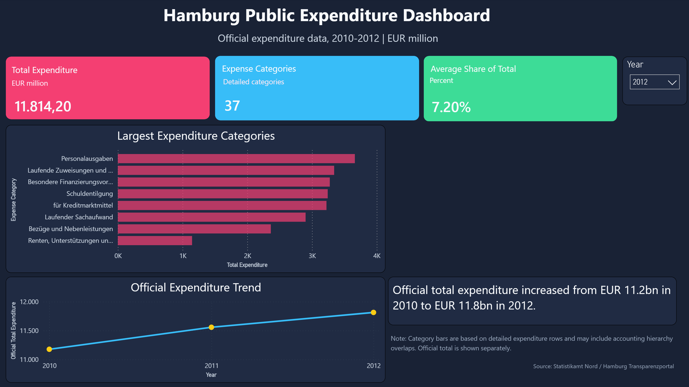
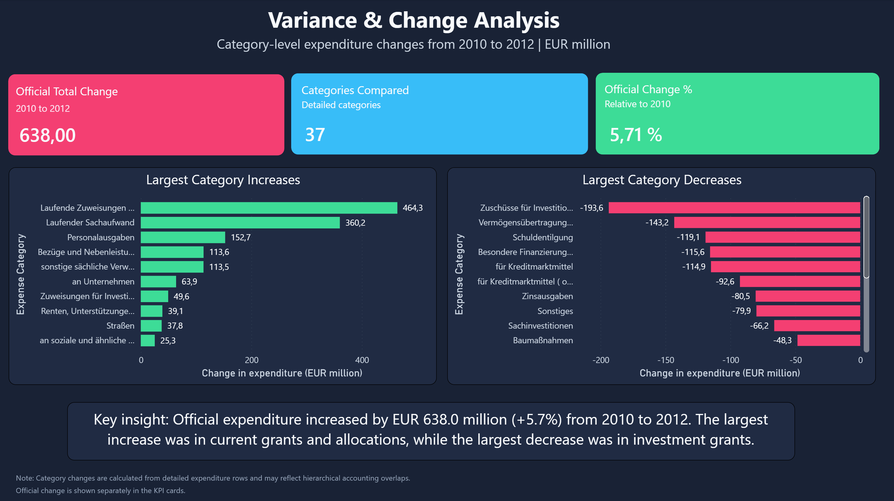
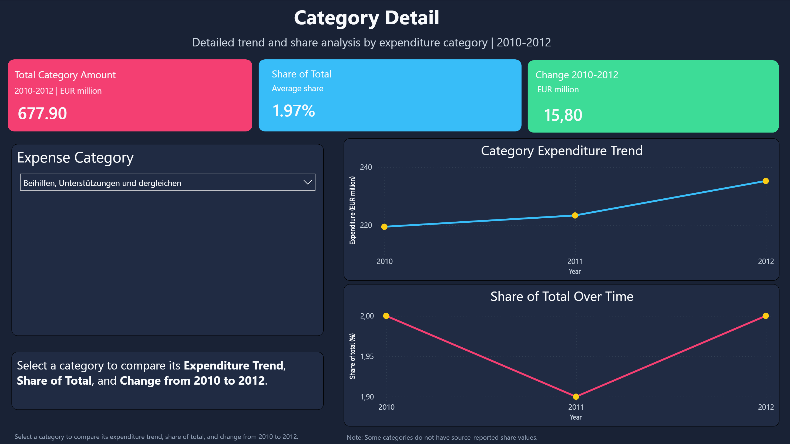

# Hamburg Public Expenditure Dashboard

Power BI portfolio project analyzing official public expenditure data from Hamburg for 2010-2012.

## Project Overview

This project transforms raw public finance data from the Hamburg Transparenzportal / Statistikamt Nord into an FP&A-style Power BI dashboard. The report is designed to show how public expenditure data can be cleaned, modeled, and presented for executive-level analysis.

The dashboard contains three pages:

1. **Executive Overview**: official total expenditure, largest expenditure categories, and expenditure trend.
2. **Variance & Change Analysis**: official total change from 2010 to 2012 and largest category-level increases/decreases.
3. **Category Detail**: interactive category-level drilldown with expenditure trend, share of total, and 2010-2012 change.

## Dashboard Preview

### Executive Overview



### Variance & Change Analysis



### Category Detail



## Business Questions

The dashboard answers questions such as:

- What was Hamburg's official total expenditure from 2010 to 2012?
- Which expenditure categories were largest in each selected year?
- How much did official expenditure change between 2010 and 2012?
- Which detailed categories increased or decreased the most?
- How did an individual category evolve over time?

## Skills Demonstrated

- Power BI dashboard design
- Power Query data cleaning and reshaping
- DAX measures and calculated tables
- Data modeling with a shared year dimension
- Handling hierarchical accounting data and double-counting risk
- Clear visual storytelling with caveats and source notes

## Project Goal

This project builds an FP&A-style dashboard from public government expenditure data. The goal is to demonstrate how raw public finance tables can be transformed into a clear management dashboard with KPIs, trend analysis, category breakdowns, and documented modeling decisions.

The project is designed to show practical skills in:

- Power BI dashboard design
- Power Query data cleaning
- Data modeling with dimension tables
- DAX measures
- Financial reporting logic
- Data interpretation and caveat documentation

## Data Source

Source: Statistikamt Nord / Hamburg Transparenzportal

Dataset used:

`Oeffentliche Ausgaben und Einnahmen Hamburgs 2010 bis 2012`

Original source format:

- CSV files inside ZIP archive
- Statistical report table, not database-ready data
- Multi-row headers
- German public finance labels
- Mixed total, subtotal, detail, and accounting adjustment rows

Main source file used:

`Tabelle 1 - Ausgaben.csv`

Processed output:

`data/processed/fact_expenses_detail.csv`

## Project Folder Structure

```text
finance-fpa-powerbi-dashboard/
├── data/
│   ├── raw/
│   ├── processed/
├── notebooks/
├── powerbi/
├── reports/
├── images/
└── README.md
```

## Step-by-Step Workflow

### 1. Source Discovery

We searched the Hamburg Transparenzportal API for public finance datasets related to public expenditures and revenues.

Candidate datasets included several editions of:

`Oeffentliche Ausgaben und Einnahmen Hamburgs`

The 2010-2012 dataset was selected because it had usable CSV/XLSX-style resources and a compact three-year period suitable for a first dashboard version.

### 2. Raw Data Import

The source CSV was imported through Power Query instead of double-clicking it in Excel because the raw file required explicit handling of:

- CSV delimiter
- German characters/encoding
- Multi-row headers
- Report title and note rows

The relevant source table was:

`Tabelle 1 - Ausgaben.csv`

### 3. Initial Data Cleaning

The raw statistical table was cleaned by:

- Removing title and metadata rows
- Renaming generic columns to meaningful names
- Removing blank rows
- Removing label rows such as `Ausgaben`, `davon`, and `darunter`
- Removing accounting adjustment rows such as `Zu- und Absetzungen`, `./. Bruttostellungen`, and `+ Nettostellungen`

### 4. Reshaping The Table

The original data was in wide format, with separate columns for each year and metric.

Original structure:

```text
Expense Category | 2010 Amount | 2010 Share | 2011 Amount | 2011 Share | 2012 Amount | 2012 Share
```

Dashboard-ready structure:

```text
Expense Category | Year | Actual Amount EUR million | Share of Total %
```

Power Query steps used:

- Unpivot other columns
- Split the attribute column into `Year` and `Metric`
- Pivot the metric column back into separate fields

### 5. Numeric Conversion

The source used dot decimals, while the local system expected comma decimals. To avoid incorrect values such as `1200.2` becoming `12002`, decimal conversion was handled carefully.

The final numeric fields are:

- `Actual Amount EUR million`
- `Share of Total %`

Errors caused by non-applicable values such as `x` were replaced with `null`.

### 6. Row Type Classification

A helper column called `Row Type` was added to distinguish between:

- `Total`
- `Subtotal`
- `Detail`

This is important because the source table contains hierarchical public finance categories. Some detail rows overlap with broader accounting rows, so blindly summing all rows can double count expenditure.

### 7. Detail Fact Table

A dashboard-ready fact table was created from detail rows only:

`Fact_Expenses_Detail`

This table is used for category-level visualizations such as the largest expenditure categories chart.

### 8. Official Totals Table

A separate table was created for official yearly totals:

`official_expense_totals`

Values:

```text
Year | Official Total Expenditure EUR million
2010 | 11176.2
2011 | 11557.4
2012 | 11814.2
```

This table is used for the official total KPI and trend line to avoid double counting from hierarchical detail categories.

### 9. Year Dimension Table

A shared year dimension table was created:

`Dim_Year`

Purpose:

- Connect the detail expense table and official totals table
- Allow one Year slicer to filter both tables consistently

DAX table:

```DAX
Dim_Year =
DISTINCT(
    UNION(
        SELECTCOLUMNS('fact_expenses_detail', "Year", 'fact_expenses_detail'[Year]),
        SELECTCOLUMNS('official_expense_totals', "Year", 'official_expense_totals'[Year])
    )
)
```

Relationships:

```text
Dim_Year[Year] -> fact_expenses_detail[Year]
Dim_Year[Year] -> official_expense_totals[Year]
```

Relationship settings:

```text
Cardinality: One to many
Cross-filter direction: Single
```

## DAX Measures Created So Far

### Total Expenditure

Used for category-level bar chart based on detail rows.

```DAX
Total Expenditure =
SUM('fact_expenses_detail'[Actual Amount EUR million])
```

### Expense Categories

Counts unique detailed expenditure categories in the selected year.

```DAX
Expense Categories =
DISTINCTCOUNT('fact_expenses_detail'[Expense Category])
```

### Average Share of Total

Average category share for the selected year.

```DAX
Average Share of Total =
AVERAGE('fact_expenses_detail'[Share of Total %])
```

### Official Total Expenditure

Used for the main official expenditure KPI and trend chart.

```DAX
Official Total Expenditure =
SUM('official_expense_totals'[Official Total Expenditure EUR million])
```

## Dashboard Pages

## Page 1: Executive Overview

### Title

`Hamburg Public Expenditure Dashboard`

### Subtitle

`Official expenditure data, 2010-2012 | EUR million`

### Goal

Provide a high-level overview of Hamburg public expenditure using official totals, category breakdowns, and a three-year trend.

### Main Elements

#### Year Slicer

Field used:

`Dim_Year[Year]`

Purpose:

- Allows the viewer to select 2010, 2011, or 2012
- Filters KPI cards and the category bar chart
- Does not filter the trend chart, so the full 2010-2012 trend remains visible

#### KPI Card: Total Expenditure

Measure:

`Official Total Expenditure`

Purpose:

Shows the official total expenditure for the selected year.

Design:

- Pink card
- Unit: EUR million
- Large white KPI value

#### KPI Card: Expense Categories

Measure:

`Expense Categories`

Purpose:

Shows the number of detailed expenditure categories available for the selected year.

Design:

- Cyan card
- Subtitle: Detailed categories

#### KPI Card: Average Share of Total

Measure:

`Average Share of Total`

Purpose:

Shows the average share of total expenditure across available detailed categories for the selected year.

Design:

- Green card
- Subtitle: Percent

#### Bar Chart: Largest Expenditure Categories

Fields:

```text
Y-axis: Expense Category
X-axis: Total Expenditure
```

Purpose:

Shows the largest detail-level expenditure categories for the selected year.

Important caveat:

The category rows come from hierarchical public finance data and may include overlapping accounting categories. Therefore, this chart is used for category comparison, while the official total KPI is shown separately.

#### Line Chart: Official Expenditure Trend

Fields:

```text
X-axis: Dim_Year[Year]
Y-axis: Official Total Expenditure
```

Purpose:

Shows official total expenditure from 2010 to 2012.

Interaction setting:

The Year slicer does not filter this chart. This allows the full trend to remain visible while other visuals respond to the selected year.

#### Insight Card

Text:

`Official total expenditure increased from EUR 11.2bn in 2010 to EUR 11.8bn in 2012.`

Purpose:

Provides a short executive interpretation of the trend.

#### Data Caveat

Text:

`Note: Category bars are based on detailed expenditure rows and may include accounting hierarchy overlaps. Official total is shown separately.`

Purpose:

Documents an important modeling limitation and shows transparency in the analysis.

#### Source Note

Text:

`Source: Hamburg Transparenzportal | Statistikamt Nord`

## Visual Design

The dashboard uses a dark executive-style theme inspired by modern admin dashboards.

### Color Palette

```text
Page background: #192235
Panel/card background: #202B43
Pink accent: #F43F72
Cyan accent: #38BDF8
Green accent: #3DDC97
Yellow accent: #FACC15
Main text: #F8FAFC
Secondary text: #CBD5E1
Muted text: #94A3B8
Gridlines: #334155
```

### Design Choices

- Dark navy page background
- Rounded KPI cards
- Bright accent colors for high-level metrics
- White titles and KPI values
- Muted gray explanatory text
- Separate caveat note for data interpretation
- Category chart and trend chart placed in dark panels

## Planned Next Pages

## Page 2: Variance & Change Analysis

### Title

`Variance & Change Analysis`

### Subtitle

`Category-level expenditure changes from 2010 to 2012 | EUR million`

### Goal

Show how Hamburg public expenditure changed between 2010 and 2012, separating official total change from category-level movements.

The page answers two questions:

- How much did official total expenditure change from 2010 to 2012?
- Which detailed expenditure categories increased or decreased the most?

### Main Elements

#### KPI Card: Official Total Change

Measure:

`Official Change 2010-2012`

Purpose:

Shows the official total expenditure increase between 2010 and 2012.

Displayed value:

`638.0 EUR million`

Design:

- Pink card
- Subtitle: `2010 to 2012`
- Large white KPI value

#### KPI Card: Categories Compared

Measure:

`Expense Categories`

Purpose:

Shows the number of detailed categories included in the comparison.

Design:

- Cyan card
- Subtitle: `Detailed categories`

#### KPI Card: Official Change %

Measure:

`Official Change % 2010-2012`

Purpose:

Shows the official expenditure increase relative to 2010.

Displayed value:

`5.71%`

Design:

- Green card
- Subtitle: `Relative to 2010`

#### Bar Chart: Largest Category Increases

Fields:

```text
Y-axis: Expense Category
X-axis: Change 2010-2012
```

Purpose:

Shows the detailed categories with the largest positive expenditure changes between 2010 and 2012.

Design:

- Green bars
- Dark panel background
- Data labels enabled

#### Bar Chart: Largest Category Decreases

Fields:

```text
Y-axis: Expense Category
X-axis: Change 2010-2012
```

Purpose:

Shows the detailed categories with the largest negative expenditure changes between 2010 and 2012.

Design:

- Pink bars
- Dark panel background
- Data labels enabled

#### Insight Card

Text:

`Key insight: Official expenditure increased by EUR 638.0 million (+5.7%) from 2010 to 2012. The largest increase was in current grants and allocations, while the largest decrease was in investment grants.`

Purpose:

Summarizes the main interpretation from the page in plain language.

#### Data Caveat

Text:

`Note: Category changes are calculated from detailed expenditure rows and may reflect hierarchical accounting overlaps. Official change is shown separately in the KPI cards.`

Purpose:

Clarifies that official total change and detail-category change are modeled separately to avoid misleading conclusions.

### DAX Measures Added For Page 2

#### Official Change 2010-2012

```DAX
Official Change 2010-2012 =
CALCULATE(
    [Official Total Expenditure],
    Dim_Year[Year] = 2012
)
-
CALCULATE(
    [Official Total Expenditure],
    Dim_Year[Year] = 2010
)
```

#### Official Change % 2010-2012

```DAX
Official Change % 2010-2012 =
DIVIDE(
    [Official Change 2010-2012],
    CALCULATE(
        [Official Total Expenditure],
        Dim_Year[Year] = 2010
    )
)
```

#### Actual 2010

```DAX
Actual 2010 =
CALCULATE(
    [Total Expenditure],
    Dim_Year[Year] = 2010
)
```

#### Actual 2012

```DAX
Actual 2012 =
CALCULATE(
    [Total Expenditure],
    Dim_Year[Year] = 2012
)
```

#### Change 2010-2012

```DAX
Change 2010-2012 =
[Actual 2012] - [Actual 2010]
```

#### Change % 2010-2012

```DAX
Change % 2010-2012 =
DIVIDE(
    [Change 2010-2012],
    [Actual 2010]
)
```

## Page 3: Category Detail

### Status

Built and styled.

### Goal

Allow the viewer to select a detailed expenditure category and inspect its expenditure amount, share of total, and change from 2010 to 2012.

This page answers:

- How much was spent in the selected category across 2010-2012?
- How did the category amount change over time?
- How did its share of total expenditure change over time?
- What was the category-level change between 2010 and 2012?

### Main Elements

#### Category Slicer

Field used:

`fact_expenses_detail[Expense Category]`

Purpose:

Allows the viewer to choose one detailed expenditure category.

Design:

- Dropdown slicer
- Dark panel background
- White text

#### KPI Card: Total Category Amount

Measure:

`Selected Category Actual Display`

Purpose:

Shows the total selected category amount across 2010-2012.

Subtitle:

`2010-2012 | EUR million`

Design:

- Pink card
- Large white KPI value

#### KPI Card: Share of Total

Measure:

`Selected Category Share Display`

Purpose:

Shows the average share of total expenditure for the selected category.

Subtitle:

`Average share`

Design:

- Cyan card
- Percent display

#### KPI Card: Change 2010-2012

Measure:

`Selected Category Change`

Purpose:

Shows the change in the selected category from 2010 to 2012.

Subtitle:

`EUR million`

Design:

- Green card

#### Line Chart: Category Expenditure Trend

Fields:

```text
X-axis: Dim_Year[Year]
Y-axis: Selected Category Actual
```

Purpose:

Shows how the selected category's expenditure changed from 2010 to 2012.

Design:

- Cyan line
- Yellow markers
- Dark panel background

#### Line Chart: Share of Total Over Time

Fields:

```text
X-axis: Dim_Year[Year]
Y-axis: Selected Category Share
```

Purpose:

Shows how the selected category's share of total expenditure changed from 2010 to 2012.

Design:

- Pink line
- Yellow markers
- Dark panel background

#### Instruction Card

Text:

`Select a category to compare its Expenditure Trend, Share of Total, and Change from 2010 to 2012.`

Purpose:

Guides the viewer on how to use the page.

#### Share Caveat

Text:

`Note: Some categories do not have source-reported share values.`

Purpose:

Explains why some selected categories may show blank share values.

### DAX Measures Added For Page 3

#### Selected Category Actual

```DAX
Selected Category Actual =
[Total Expenditure]
```

#### Selected Category Actual Display

```DAX
Selected Category Actual Display =
FORMAT(
    [Selected Category Actual],
    "#,##0.00"
)
```

#### Selected Category Share

```DAX
Selected Category Share =
AVERAGE('fact_expenses_detail'[Share of Total %])
```

#### Selected Category Share Display

```DAX
Selected Category Share Display =
FORMAT(
    [Selected Category Share],
    "0.00"
) & "%"
```

#### Selected Category Change

```DAX
Selected Category Change =
[Actual 2012] - [Actual 2010]
```

#### Selected Category Change %

```DAX
Selected Category Change % =
DIVIDE(
    [Selected Category Change],
    [Actual 2010]
)
```

## Repository Artifacts

Main files and folders:

```text
powerbi/finance_fpa_dashboard.pbix
images/executive_overview.png
images/variance_change_analysis.png
images/category_detail.png
data/processed/fact_expenses_detail.csv
README.md
```

The `.pbix` file contains the full Power BI report. The `images/` folder contains exported screenshots for GitHub and portfolio presentation.

## Current Status

Completed:

- Data source selected
- Raw CSV imported and cleaned
- Detail fact table created
- Official totals table created
- Year dimension created
- Executive Overview page built and styled
- Variance & Change Analysis page built and styled
- Category Detail page built and styled
- Dashboard screenshots exported to `images/`
- GitHub repository initialized and published

## Recommended Next Steps

- Add this project to the portfolio website as a Power BI / FP&A dashboard project
- Add the repository to the GitHub profile README featured projects section
- Pin the repository on the GitHub profile
- Use the project in applications for Data Analyst, BI Analyst, and FP&A reporting roles
- Optionally extend the dashboard with newer public finance data if comparable source tables are available

